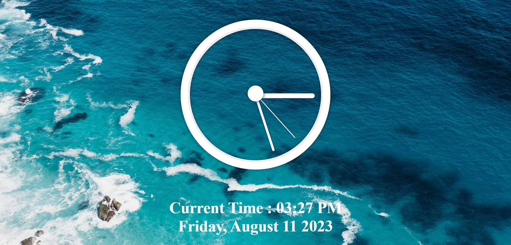

# 02---JS-and-CSS-Clock

This is day two of #JavaScript30 challenge 

Created this awesome Analog Clock using HTML, CSS, and JS.

In this project learned about
- Date() in JS
- converting number of hours, minutes and seconds into degrees 
- Converting 24hr time to 12hr time
- playing audio using JS
- Displaying current date and time
- transform-origin property
